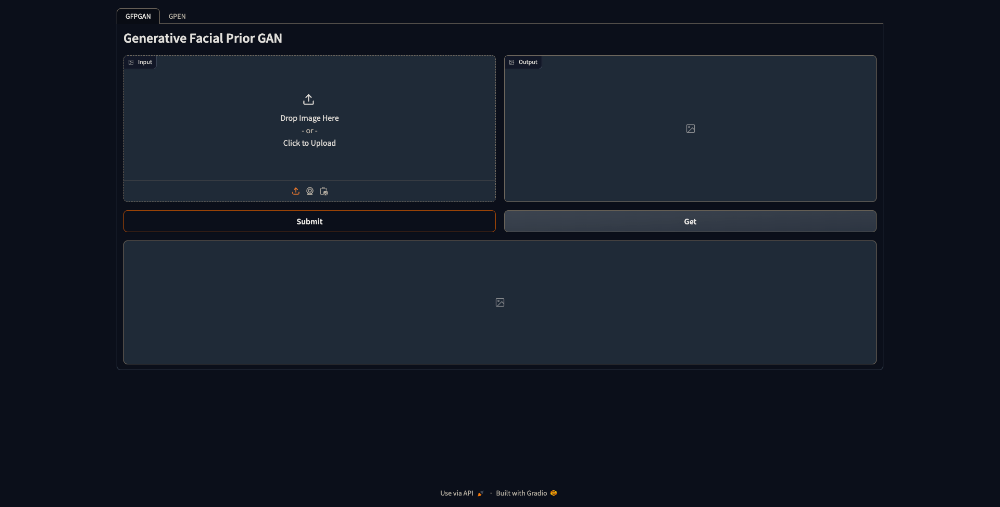

# GFPGAN-webui

Based on the [original GFPGAN](https://github.com/TencentARC/GFPGAN), built with gradio, tailored for my use case

- Simple to use, one-click inference
- Could take advantage of AMD GPU and be able to release the it to save power after each run
- Allow retrieval of previously processed images in case of connection failure
- Easy deployment and replication through Docker image

Web UI screenshot



## Development

1. Rename the corresponding `pyproject.*.toml` file of your target runtime to `pyproject.toml`

2. Install dependencies with **Pypoetry**

```bash
poetry install --no-root
```

3. Run with `scripts/run_cpu.sh` or `scripts/run_rocm.sh` if an AMD GPU is available.

> Note that in order to run with AMD GPUs, ROCm package is required, instruction on the installation could be found over [ollama development docs](https://github.com/ollama/ollama/blob/main/docs/development.md#linux-rocm-amd).

## Build Docker images

Details could be found in `scripts/build_docker_*.sh` file

## Usage

Rename the corresponding `docker-compose.*.yaml` file of your target runtime to `docker-compose.yaml`

```bash
docker compose up -d
```

> Note that the ROCm image is massive, almost 20GB when compressed and 60GB to store locally. The CPU-only image is available on Docker Hub, but a image build is required to run ROCm version.